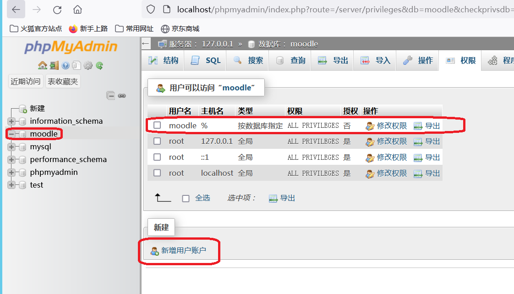

# Moodle

<p align="center"><a href="https://moodle.org" target="_blank" title="Moodle Website">
  
</a></p>

[Moodle][1] is the World's Open Source Learning Platform, widely used around the world by countless universities, schools, companies, and all manner of organisations and individuals.

Moodle is designed to allow educators, administrators and learners to create personalised learning environments with a single robust, secure and integrated system.

## Documentation

- Read our [User documentation][3]
- Discover our [developer documentation][5]
- Take a look at our [demo site][4]

## Community

[moodle.org][1] is the central hub for the Moodle Community, with spaces for educators, administrators and developers to meet and work together.

You may also be interested in:

- attending a [Moodle Moot][6]
- our regular series of [developer meetings][7]
- the [Moodle User Association][8]

## Installation and hosting

Moodle is Free, and Open Source software. You can easily [download Moodle][9] and run it on your own web server, however you may prefer to work with one of our experienced [Moodle Partners][10].

Moodle also offers hosting through both [MoodleCloud][11], and our [partner network][10].

## License

Moodle is provided freely as open source software, under version 3 of the GNU General Public License. For more information on our license see

[1]: https://moodle.org
[2]: https://moodle.com
[3]: https://docs.moodle.org/
[4]: https://sandbox.moodledemo.net/
[5]: https://moodledev.io
[6]: https://moodle.com/events/mootglobal/
[7]: https://moodledev.io/general/community/meetings
[8]: https://moodleassociation.org/
[9]: https://download.moodle.org
[10]: https://moodle.com/partners
[11]: https://moodle.com/cloud
[12]: https://moodledev.io/general/license


# Install on Windows Server (Use all-in-one bundle installer)

Download ["Moodle installer package for Windows"](https://download.moodle.org/windows/).

If IIS has already taken port 80 and 443, revise the conf files.

apache/conf/http.conf 

`Listen 80`
`ServerName localhost:8008`

apache/conf/extra/http-ssl.conf  

`Listen 443`

Admin accounts for SZEH, 
```
mariadb root root

admin
oo@zju.edu.cn
Moodle32...!
```

# Install on Windows Server (use XAMPP)

git clone https://github.com/zhangys11/moodle to htdocs.   

Upgrade mariadb version if necessary.  
```
Download mariadb-10.6.17-winx64.zip and replace /xampp/mysql.  
Keep scripts, mysql_uninstallservice.bat and mysql_installservice.bat and /bin/my.ini.
```

On xampp control panel, click mysql "admin". Create a mysql database "moodle" and add a user named "moodle",


Download libsodium.dll and copy to Windows/System32  

php.ini  
```
max_input_vars = 5000
post_max_size=300M
upload_max_filesize=400M
max_execution_time=300
```

Revise `config.php`, set properly and launch web browser.

Admin accounts for INSTITUTE, 
```
mariadb moodle moodle

admin
oo@zju.edu.cn
Moodle123..!
```

# Trouble Shooting

```
To speed up the system, enable OPCache + JIT. However, after enabling OPCache + JIT I started getting a "white screen" and the message "virtualprotect() failed 87 the parameter is incorrect".  
After disabling OPCache + JIT or OPCache the problem went away.

- win: Apache + PHP as a module - !!! JIT problem !!!
- win: IIS + PHP as FastCGI - OK
- win: PHP CLI - OK
- nix: Apache + PHP as a module - OK
- nix: NGINX + PHP as FastCGI - OK
- nix: PHP CLI - OK
```

# Install on Linux

## [Optional] 增加swap
```
root@VM-4-15-ubuntu:~# free -m
               total        used        free      shared  buff/cache   available
Mem:            3400        1884         128          18        1387        1207
Swap:              0           0           0
root@VM-4-15-ubuntu:~# swapoff -a
root@VM-4-15-ubuntu:~# dd if=/dev/zero of=/var/swapfile bs=1M count=1024
1024+0 records in
1024+0 records out
1073741824 bytes (1.1 GB, 1.0 GiB) copied, 2.84705 s, 377 MB/s
root@VM-4-15-ubuntu:~# mkswap /var/swapfile
mkswap: /var/swapfile: insecure permissions 0644, fix with: chmod 0600 /var/swapfile
Setting up swapspace version 1, size = 1024 MiB (1073737728 bytes)
no label, UUID=bf710ecf-7989-49c0-b8b1-583064794642
root@VM-4-15-ubuntu:~# swapon /var/swapfile
swapon: /var/swapfile: insecure permissions 0644, 0600 suggested.
root@VM-4-15-ubuntu:~# free -m
               total        used        free      shared  buff/cache   available
Mem:            3400        1877         124          18        1397        1223
Swap:           1023           3        1020
```

## Install PHP

```
PHP Versions

    Moodle 3.0.1 and later support PHP 7, however
        Moodle 3.1 and earlier does not support PHP 7.1 or later (this means that there is currently no combination of releases of Moodle and PHP that are still supported before Moodle 3.4);
    Moodle 3.4 and Moodle 3.5 require PHP 7.0 or PHP 7.1 or PHP 7.2
    Moodle 3.6 requires PHP 7.0 or later
    Moodle 3.7 requires PHP 7.1 or later
    Moodle 3.9 requires PHP 7.2 to 7.4
    Moodle 3.11 and 4.0 requires PHP 7.3 to 8.0
    Moodle 4.1 (LTS) requires PHP 7.4 to 8.1
    Moodle 4.2 requires PHP 8.0 to 8.2
    Moodle 4.3 requires PHP 8.0 to 8.2
```

php.ini  
max_input_vars = 5000


## Install PHP PGSQL extension

```
root@VM-4-15-ubuntu:/home/php82/php-8.2.16-src/ext/pgsql# ls
config.m4  config.w32  CREDITS  pgsql_arginfo.h  pgsql.c  pgsql.stub.php  php_pgsql.h  tests

root@VM-4-15-ubuntu:/home/php82/php-8.2.16-src/ext/pgsql# whereis phpize
phpize: /usr/bin/phpize

root@VM-4-15-ubuntu:/home/php82/php-8.2.16-src/ext/pgsql# /usr/bin/phpize

Configuring for:
PHP Api Version:         20220829
Zend Module Api No:      20220829
Zend Extension Api No:   420220829

root@VM-4-15-ubuntu:/home/php82/php-8.2.16-src/ext/pgsql# ./configure --with-php-config=/www/server/php/82/bin/php-config
...
/bin/sh /home/php82/php-8.2.16-src/ext/pgsql/libtool --tag=CC --mode=install cp ./pgsql.la /home/php82/php-8.2.16-src/ext/pgsql/modules
cp ./.libs/pgsql.so /home/php82/php-8.2.16-src/ext/pgsql/modules/pgsql.so
cp ./.libs/pgsql.lai /home/php82/php-8.2.16-src/ext/pgsql/modules/pgsql.la
PATH="$PATH:/sbin" ldconfig -n /home/php82/php-8.2.16-src/ext/pgsql/modules
----------------------------------------------------------------------
Libraries have been installed in:
   /home/php82/php-8.2.16-src/ext/pgsql/modules

Build complete.

Installing shared extensions:     /www/server/php/82/lib/php/extensions/no-debug-non-zts-20220829/
```